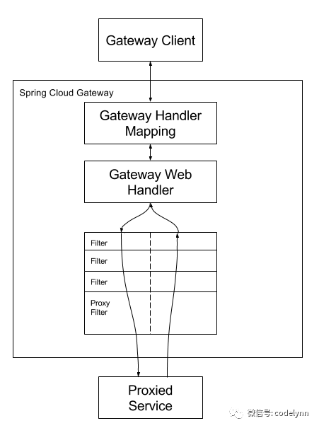
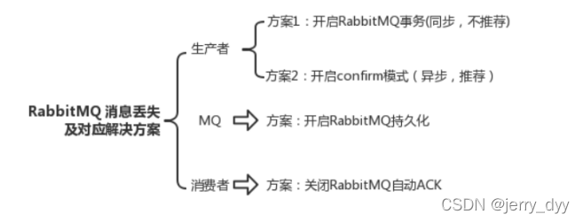

# 商城秒杀模块 项目详解

## 项目简介

1. 该项目是一个基于分布式微服务架构的商城秒杀模块。
2. 针对高并发大流量的秒杀场景建立了一套完整的解决方案。
3. 可以实现从用户发起请求，到库存扣减，生成订单的整个流程。
4. 项目中，通过请求限流，库存预热，订单异步生成等架构和思想，增加了系统的承载能力。
5. 通过基于redis的分布式锁保证了服务间的线程安全。

---

## 总体流程分析

- 客户端共有四种请求：**页面请求、登录请求、秒杀请求、支付请求**
- 所有请求首先都要经过nginx处理和分发，发送给服务的请求都需要经过网关鉴权和限流

#### 1. 页面请求

- 商品信息服务(从redis中获取商品当前库存，从数据库中查找商品详细信息)
    - 采用动静分离的策略
    - 静态资源直接由nginx处理并返回
    - 动态资源由nginx分发给对应的服务进行处理
    - 采用axios请求并显示

#### 2. 登录请求

- 登录服务
    - 功能1：由登录页面进行访问，进行登录
    - 功能2：查询用户登录状态
    - 每个token有30min的超时时间，每次操作都会重置该时间

#### 3. 秒杀请求

- 登录鉴权服务
    - 采用SpringCloud-Gateway**检查登录状态、处理秒杀请求和支付请求**
    - 获取请求header中的token，若为空或者token失效(通过rpc调用登录服务进行查询)，则鉴权失败，**重定向到登录页面**，要求登录
- 秒杀鉴权服务
    - 采用SpringCloud-Gateway**检查登录状态、检查秒杀权限**
    - 若没有登录，则重定向到登录页面
    - 若**没有秒杀权限或该用户已经有一个请求在处理**，则返回秒杀相关信息(已秒杀过该商品、商品已售罄、秒杀已结束)
    - 若有秒杀权限，则通过令牌桶算法对请求进行限流
    - 通过令牌桶限流的秒杀请求，**采用rpc调用的方式将秒杀请求发送给秒杀服务**
      (采用**自己搭建的rpc框架，基于CompletableFuture的异步调用**，刚开始用Feign，但是是同步调用的方式，效率低。
      异步调用的需求也可以交给MQ来完成，但是由于需要及时响应，因此采用rpc更符合要求)
- 秒杀服务
    - 收到用户秒杀请求，进行库存预减，将订单创建请求放入MQ中，**迅速响应**
    - 在秒杀redis中标记该用户
- 订单服务
    - 从MQ中获取订单创建请求(包含用户信息，商品信息等)
    - 生成订单号，创建订单
    - 写DB(订单信息，库存扣减，分布式锁在此使用)

#### 4. 支付请求

- 登录鉴权服务
- 支付服务
    - 检查订单状态，若已支付或者订单已经过期，则直接返回
    - 生成支付链接
    - 轮询检查支付状态，若已支付则写DB(支付信息表)
---

## 主要组件和功能

#### 1. Nginx

- 动静分离
    1. 项目采用nginx实现动静分离。
    2. 对于静态资源的访问，比如图片，静态页面等内容直接由nginx直接访问并返回。
    3. 对于动态资源的访问，比如查看当前库存，秒杀请求等，则由nginx转发到负责处理相关业务的tomcat服务器进行处理并返回。
- 负载均衡
    1. 在访问动态资源过程中，采用nginx实现负载均衡。
    2. 由于项目采用分布式微服务架构，同一个服务可能会有多个实例，
       因此不管是用户访问还是服务间访问，都需要nginx进行负载均衡。
    3. 有**轮询、加权轮询、ip_hash、fair(根据响应时间)、url_hash**共五种负载均衡策略

#### 2. SpringCloud-Gateway

- 项目采用SpringCloud-Gateway作为网关，实现鉴权
- 通过鉴权后，采用令牌桶算法进行限流

#### 3. redis

- 存在两种存放不同类型数据的redis实例
- 用户信息redis: **token缓存，令牌桶限流，记录正在处理的用户秒杀请求**
- 商品信息redis: **库存预热，库存预减**

#### 4. rabbitMQ

- 订单异步处理(需要保证不丢失)
- 回仓(定时回仓)

#### 5. MySQL

- 商品相关
    1. 商品信息表(商品id、商品描述、商品库存、是否参加秒杀)
    2. 秒杀商品表(秒杀开始前准备，商品id、秒杀数目)
- 用户相关
    1. 用户信息表(用户id、用户名、用户密码+salt的md5值、salt值、用户是否有秒杀权限)
    2. 订单表(用户id、商品id、订单号、订单创建时间)
    3. 支付信息表(用户id、订单号、支付号、支付时间)

---

## 重要概念

#### 1. 动静分离
http配置块下
````
server {
    keepalive_requests 120; #单连接请求上限次数。
    listen       4545;   #监听端口
    server_name  127.0.0.1;   #监听地址       
    location  ~*^.+$ {       #请求的url过滤，正则匹配，~为区分大小写，~*为不区分大小写。
       root path;  #根目录，用户动静分离
       #index vv.txt;  #设置默认页
       proxy_pass  http://mysvr;  #请求转向mysvr 定义的服务器列表，用于负载均衡
       deny 127.0.0.1;  #拒绝的ip
       allow 172.18.5.54; #允许的ip
    } 
}
````
#### 2. 负载均衡
http配置块下
````
upstream mysvr {
    ip_hash;    #负载均衡策略
    server 127.0.0.1:7878;
    server 192.168.10.121:3333 backup;  #热备
}
````

#### 3. SpringCloud-Gateway的使用
- 过滤请求和权限验证

- login网关
  1. 对于页面信息请求，直接路由到页面信息服务中
  2. 对于登录或者秒杀请求，经过路由后，还需要经过GatewayFilter的登录验证，
  若没有登录，则**直接重定向到登录页面**，
  若已经登录，则**将请求路由给秒杀限流网关**
- seckill网关
  1. 对于秒杀请求，若可以通过路由，则需要经过几个filter进行判断
  2. 若秒杀已结束，则直接返回
  3. 若没有秒杀权限，则直接返回
  4. 若当前用户已经秒杀过目标商品，则直接返回
  5. 最后经过令牌桶算法进行请求限流，获取令牌的请求发送给秒杀服务进行处理

#### 4. 限流算法
- 令牌桶算法
  1. 采用redis的list实现，lpush和rpop
  2. 设定令牌桶的大小
  3. 一个定时任务循环向redis中放入令牌
  4. 秒杀请求首先要获得一个令牌才能得到接下来的处理
- 漏桶算法
  1. 采用MQ实现
  2. 请求放入MQ等待处理(不限速度，当队列满了之后就直接丢弃请求)
  3. 接收方按照一定速度从MQ中获取请求并进行处理
- 基于redis的zset的限流方法
  1. 采用zset记录请求数目，并以请求时间戳为score
  2. 每次请求都从zset中获取前n秒到现在的请求总数
  3. 若请求总数达到了限制，则该请求被丢弃
- 限流的位置
  1. 主要针对秒杀请求进行限流
  2. 限流逻辑放在秒杀鉴权服务中
  3. 只有通过了限流的请求，才会真正被发送到秒杀服务进行处理

#### 5. MQ如何保证消息不丢失

- 消息生产者到mq
  1. confirm机制，mq收到消息后返回ack消息
  2. mq事务(不推荐)
- mq丢失数据
  1. 开启mq的持久化，有两个步骤：
     - 创建queue时将其设置为持久化
     - 发送消息时将deliveryMode设置为2
- 消费端丢失数据
  1. 采用RabbitMQ的ack机制(先关闭自动ack)
#### 6. 商品回仓

#### 7. 短轮询查看商品状态

×××使用哪个服务进行处理
×××数据库和redis的同步(分布式事务)

#### 7. 分布式事务

#### 8. 限流思想
- 尽量将请求拦截在整个服务链条的上游
- 前端按钮限流
- 秒杀网关限流(鉴权，已售罄)，基于令牌桶限流
- 到了秒杀服务时，流量已经被限制得很小，可以直接处理

---

## 重要问题
#### 1. 超卖问题
- 使用redis+lua脚本，判断若>0则decr
- 使用队列异步生成订单，操作数据库，
- 若订单服务为集群，则需要加锁保证原子性(分布式锁或者mysql乐观锁，悲观锁)

#### 2. 高并发问题
- 请求限流
- redis库存预减
- 订单异步生成

#### 3. 接口防刷
- 前后端配合
- 前端点击秒杀按钮，动态获取秒杀链接
- 秒杀链接由服务端生成(随机id)，保存在redis中
- 秒杀鉴权服务接收到秒杀请求时，存在判断url是否有效的步骤，
  若有效，则继续执行，若无效，则直接返回错误信息

#### 4. 数据库设计
- 秒杀数据库和其他业务数据库分离